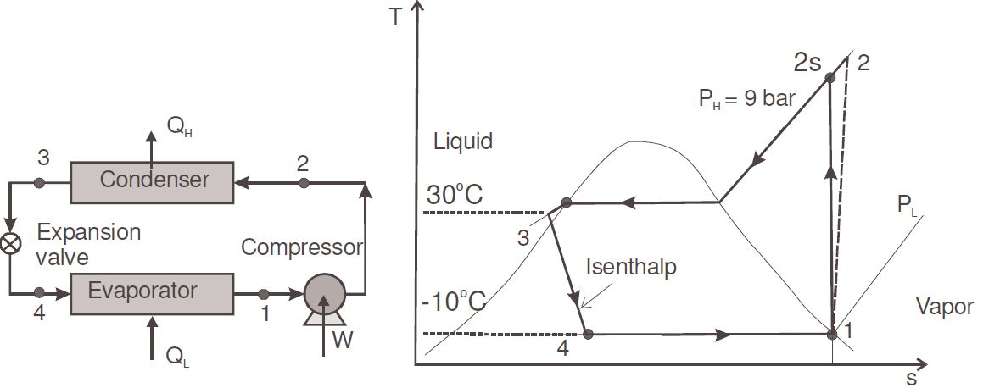
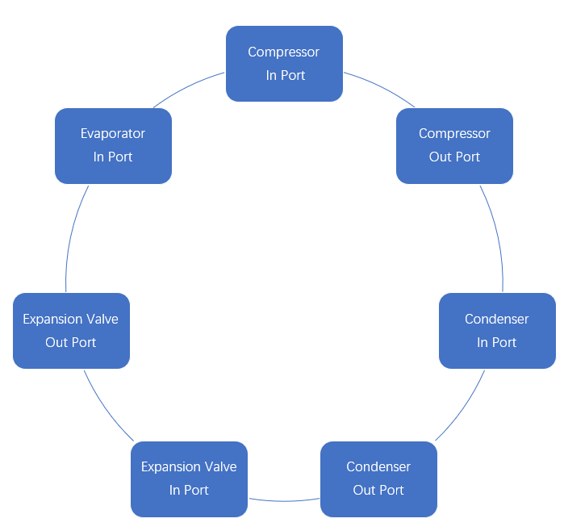
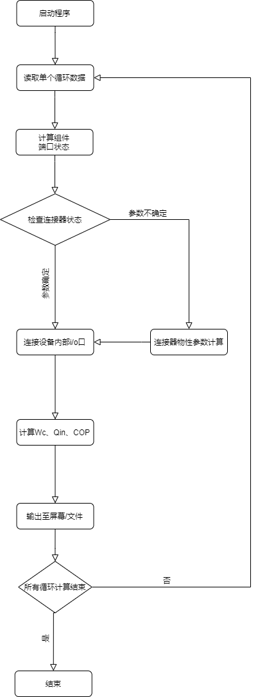

#Practice 2
03118616乐辰前
###设计任务简要描述：
以SimVCC内的Python语言版本为基础，实现对制冷工质134a的下述不可逆非等熵过程计算。
制冷循环如图

#####主要任务：
1. compressor压缩机类模块修改：属性、计算及输出

   * 循环Example 7.2-5：已知压缩机效率
 
   * 修改了已知参数的循环Example 7.2-5：已知压缩机出口温度，计算压缩机效率

2. 循环数据Python模块修改

   * 数据模块节点和设备字典的定义, 适应多种类型循环系统的数据描述
###设计方案简要描述
   1. 端口、设备、端口连接关系：
      
   2. 循环输入数据变量的数据结构：
      为实现对整体循环的数据输入，需要对于各个部件的iPort和Oport进行数据输入。但仅需循环内的部分部件的数据得到输入，即可通过循环内置函数进行查表等方式获得下一部件I/O口的工质参数。
      以下为各个部件输入案例：
      Compressor
      ```
      "name": "Compressor",
        "devtype": "COMPRESSOR",
        "iPort": {"t": -10.0,  "x":1,"mdot":0.08},
        "oPort": {},
        "ef":1.0
        ```
       t: Temperature
       x: Quality
       mdot: Mass Flow Rate
       ef: Efficiency of Compressor
       <br/>
      
      Condenser
      ```
      "name": "Condenser",
        "devtype": "CONDENSER",
        "iPort": {},
        "oPort": {"p":0.9,  "x":0}
        ```
      p: Pressure of Refrigerant 
      <br/>
      
      Expansion Valve:
      ```
      "name": "ExpansionValve",
        "devtype": "EXPANSIONVALVE",
        "iPort": {},
        "oPort": {},
        ```
      <br/>

      Evaporator:
      ```
      "name": "Evaporator",
        "devtype": "EVAPORATOR",
        "iPort": {},
        "oPort": {},
        ```
   3. 端口、设备、连接器、循环分析类
      * 端口(Port): <p>设计了端口类，并内置各类数据查询函数。通过数据查询函数实现以两个物性参数获得工质当前工作环境下的整体物性参数并储存。
      * 设备:<p>设备类包括Compresser,Condenser,Evaporator,Expansion Valve。通过各种设备类的搭建实现对于循环数据的输入并储存，并搭建一个当前设备内的I/O Port的数据传输通道，以实现工质在各类设备内的循环数据计算。
      * 连接器: <p>连接器通过node实现上一端口与下一端口的连接与数据记录。
      * 循环分析类:<p>将所有的设备、端口、连接器统筹至一个数据内，达到当前循环的总体调控。
      <br/>
   4. 端口连接、连接节点物性和循环计算等算法
      * 端口连接<P>Connector类内置函数getnodevalue()和addconnector()。Getnodevalue函数将当前端口的数据输入至node[]内，实现当前端口的数据储存。Addconnector函数以connector的index以储存当前端口的运行次数，并将两个端口连接起来。
      * 连接节点物性算法<P>连接节点的物性算法存在port类内，主要手段即已知的当前工质的两个物性参数，通过CoolProp查询当前物性状态下的其他参数并进行储存。算法内需要通过bool型的stateok参数以表示当前物性状态查询是否完成。示例如下：
      ```
          def tx(self):
        try:
            self.p = cp.PropsSI('P', 'T', 273.15+self.t,
                                'Q', self.x, 'R134a')/1.0e6
            self.h = cp.PropsSI('H', 'T', 273.15+self.t,
                                'Q', self.x, 'R134a')/1000
            self.s = cp.PropsSI('S', 'T', 273.15+self.t,
                                'Q', self.x, 'R134a')/1000
            self.stateok = True
        except:
            self.stateok = False
      ```
      * 循环算法<p>整体循环即通过vccapp.py调用vccobj.py的simulator实现循环的计算。
   5. 循环分析流程图
      
###练习中遇到的问题及解决过程
   初看程序，将输入数值直接修改为所需数值。发现数值数值与预期不符。通过深入理解程序后了解到程序的基本运作方式。并通过对于程序语句的添加、修改，最终实现了非等熵制冷过程的计算。<P>修改代码如下：
   ```
      if self.ef == 1.0:
         self.oPort[0].s = self.iPort[0].s
        ##if it's not ideal,outport.s needs to be determined by .state() function.
      else:
         self.oPort[0].s = None
      self.isos = self.iPort[0].s
   ```
   上述代码在非理想情况下，将机器出口点的熵值记为None，防止其进出口熵值混淆。
   ```
   #(add)judge the state of efficiency!
        if self.ef==1.0:
            self.Wc = self.iPort[0].mdot * (self.oPort[0].h - self.iPort[0].h)
        else:
            self.Wc = self.iPort[0].mdot * (self.hs - self.iPort[0].h)/self.ef
   ```
   上述代码通过if，else语句分情况计算了Wc。
   最终结果存于[result](.\result)
###工作小结
1. **工业过程仿真软件开发现状**
   现今软件产业极为发达，各式各样的软件层出不穷。但是在工业领域能够很好地完成工业过程计算的软件相对较少。究其原因，即专业领域复合型人才较少。例如，一个人在计算机软件开发领域造诣极高，但是在其他科学领域（如热力学）的能力几乎为0，则无法很好对相应的工业软件由很好的理解，最终导致软件不成熟甚至与事实相悖。我国工业仿真软件产业与外国相应产业相比具有较大的缺失。如Fluent，CAD等等相应领域的主流软件均为外国公司所开发。因此，以我的拙见，高等教育不仅应该培养单个领域的高端人才，更应培养多个领域的复合型人才，这一才能进一步推动当前领域的发展。
2. **软件开发模式**
   软件开发模式共有瀑布模型、迭代式开发、螺旋开发、敏捷开发四种模式。
   **传统的瀑布式开发**，也就是从需求到设计，从设计到编码，从编码到测试，从测试到提交大概这样的流程，要求每一个开发阶段都要做到最好。
   特别是前期阶段，设计的越完美，提交后的成本损失就越少。

   **迭代式开发**，不要求每一个阶段的任务做的都是最完美的，而是明明知道还有很多不足的地方，却偏偏不去完善它，而是把主要功能先搭建起来为目的，以最短的时间，   最少的损失先完成一个“不完美的成果物”直至提交。然后再通过客户或用户的反馈信息，在这个“不完美的成果物”上逐步进行完善。

   **螺旋开发**，很大程度上是一种风险驱动的方法体系，因为在每个阶段之前及经常发生的循环之前，都必须首先进行风险评估。

   **敏捷开发**，相比迭代式开发两者都强调在较短的开发周期提交软件，但是，敏捷开发的周期可能更短，并且更加强调队伍中的高度协作。   敏捷方法有时候被误认为是无计划性和纪律性的方法，实际上更确切的说法是敏捷方法强调适应性而非预见性。适应性的方法集中在快速适应现实的变化。当项目的需求起了变化，团队应该迅速适应。这个团队可能很难确切描述未来将会如何变化.
   在我看来，在面对不同的软件开发条件（如时间、经费等）下，应该合理的选择上述的开发模型，以完成自己的软件开发工作。