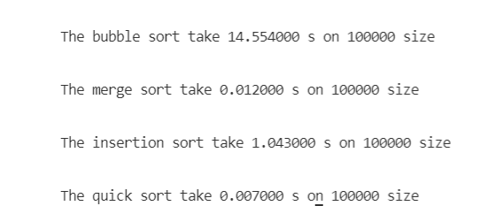
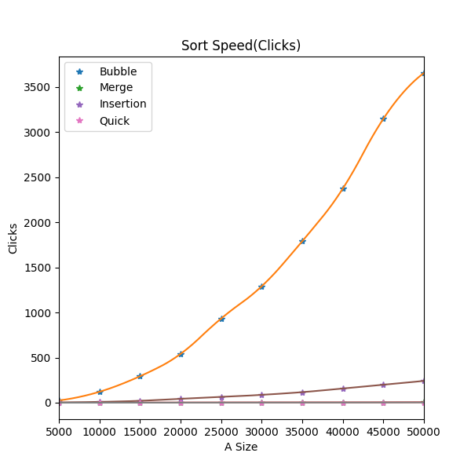
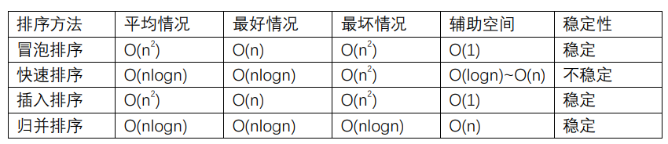

## 工作总结
#### 速度测试结果
1. 使用单一数据集测试：<p>
运行测试：
```
make -f makefile.mk
```
结果如下：
   
2. 使用多组数据集测试：<p>
```
make -f makegroup.mk
make -f makegroup.mk run
python plot_speed.py
```
   
#### 算法分析
##### 1.四种排序算法要点
* **冒泡排序**：比较相邻的两个数，如果前者比后者大，则进行交换。每一轮排序结束，选出一个未排序中最大的数放到数组后面。
* **快速排序**：选取一个基准元素，通常为数组最后一个元素（或者第一个元素）。从前向后遍历数组，当遇到小于基准元素的元素时，把它和左边第一个大于基准元素的元素进行交换。在利用分治策略从已经分好的两组中分别进行以上步骤，直到排序完成。
* **插入排序**:和交换排序不同的是它不用进行交换操作，而是用一个临时变量存储当前值。当前面的元素比后面大时，先把后面的元素存入临时变量，前面元素的值放到后面元素位置，再到最后把其值插入到合适的数组位置。　　　　
* **归并排序**:归并算法应用到分治策略，简单说就是把一个答问题分解成易于解决的小问题后一个个解决，最后在把小问题的一步步合并成总问题的解。这里的排序应用递归来把数组分解成一个个小数组，直到小数组的数位有序，在把有序的小数组两两合并而成有序的大数组。
##### 2.四种排序算法的时间、空间复杂度和排序稳定性
四种排序算法的具体性质如下表：<P>

##### 3.四种排序算法适用场景
* **冒泡排序**：适用的情景为数据量不大，对稳定性有要求，且数据基本有序的情况下。
* **快速排序**：由于快速排序的原理，常用于查找一组中前k大的数据，且输入数据基本有序的情况。
* **插入排序**：适用于数据量不大，对算法的稳定性有要求，且数据局部或者整体有序的情况。　　　　
* **归并排序**：当数据量较大，要求速度较快的时候可以使用归并算法。